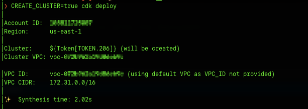
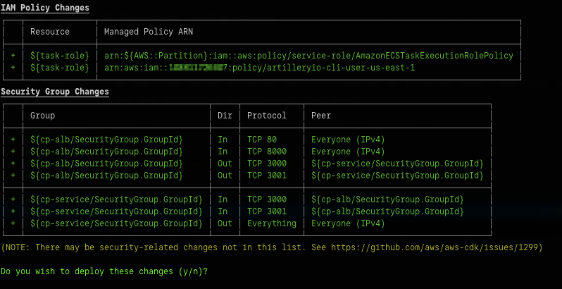

# Artillery cloud-native installer for AWS

This is the official, recommended, and supported method to install Artillery dashboard in AWS.


ℹ️ **NOTE**
Artillery dashboard is currently in private beta and requires an active deployment of [Artillery Pro](https://www.artillery.io/pricing). To join the beta, please get in touch via [team@artillery.io](mailto:team@artillery.io)


## Introduction

This [AWS CDK](https://aws.amazon.com/cdk/)-based installer creates all of the required components to get started with a self-hosted Artillery dashboard.

## Pre-requisites

- Active Artillery Pro installation (this code references an IAM policy created by Artillery Pro)
- CDK CLI installed (`npm install -g aws-cdk`)
- AWS profile set up with a default region
- A GitHub OAuth app created to configure login with GitHub ([GitHub docs](https://docs.github.com/en/developers/apps/building-oauth-apps/creating-an-oauth-app))
  - The app can be created under any GitHub account that you or your team control. You can start with a GitHub app in your own account, and change it later.

## Usage

### Deploy Artillery dashboard stack

Set up dependencies:

```shell
export DEFAULT_AWS_REGION=us-east-1 # the region where Artillery Pro is deployed
npm install
cdk bootstrap # bootstrap AWS CDK
```

Set required configuration for the app:

#### `GITHUB_ALLOWED_USERS`

This parameter specifies GitHub usernames that may log into the dashboard and is expected to be a JSON list.

For example, to allow the GitHub user `hassy` to login, run:

```shell
artillery set-config-value --name GITHUB_ALLOWED_USERS --value '["hassy"]'
```

#### `GITHUB_CLIENT_ID` and `GITHUB_CLIENT_SECRET`

These need to be set to a valid client ID and client secret for a GitHub OAuth app. See [GitHub docs](https://docs.github.com/en/developers/apps/building-oauth-apps/creating-an-oauth-app) for details on how to create an app. **Note:** set "Authorization Callback URL" to `http://localhost` initially. You will update this setting with the actual URL of Artillery dashboard once you've deployed it.

```shell
artillery set-config-value --name GITHUB_CLIENT_ID --value abcd123
artillery set-config-value --name GITHUB_CLIENT_SECRET --value abcd123
```

### `NEXTAUTH_SECRET`

Run the following command to set this value to a randomly-generated string:

**NOTE**: you will need `pwgen` installed (e.g. `brew install pwgen` / `apt-get install pwgen`)

```shell
artillery set-config-value --name NEXTAUTH_SECRET --value "$(pwgen 32 -1)"
```

#### Deploy the dashboard

Minimum configuration deployment of Artillery dashboard:

```shell
CREATE_CLUSTER=true cdk deploy
```

The CDK will synthesize a CloudFormation stack, display a summary of resources that will be created, and ask for confirmation to start the deployment:





Once confirmed, a CloudFormation stack will be created, which will create:

- a new Fargate cluster in the default VPC
- a Fargate service running Artillery dashboard
- an internal ALB to front the service

#### Finish the installation

When the deployment is completed, the CDK will print the DNS name of the load balancer it has created.


Use that URL to update the "Authorization Callback URL" setting for the GitHub app.

You should now be able to go to that URL in the browser and log into Artillery dashboard.

### Configuration

The stack supports a variety of deployment configurations.

#### Control Panel visibility

By default, Control Panel will be deployed as an internal service (behind an internal ALB), and will only be accessible through a VPN. To create an internet-facing deployment, set the following environment variables:

- `USE_INTERNET_FACING_ALB=true`
- `USE_TLS=true`
- `ACM_CERT_ARN=arn:aws:acm:arn-of-an-acm-certificate-to-use`

#### VPC

By default, the deplayment will be created in the default VPC. If the default VPC does not exist, or if you want to designate a specific VPC, set the following environment variable:

- `VPC_ID=<id of a VPC>`, e.g. `VPC_ID=vpc-id-12345`

#### Fargate cluster

Control Panel can be deployed to an existing Fargate cluster, or the stack can create one for you. This can be configured with the following environment variables:

- `FARGATE_CLUSTER_NAME` - the name of the Fargate cluster to use, defaults to `artilleryio-cluster`
- `CREATE_CLUSTER` - set to `true` to create the cluster, leave out if the cluster already exists

#### Secondary deployment

If you have a secondary deployment of Artillery Pro, configure Artillery dashboard to use that deployment by setting `ARTILLERY_BACKEND=<region of secondary deployment>`, e.g.:

```shell
ARTILLERY_BACKEND=eu-central-1 cdk deploy
```

## Useful commands to work with the CDK

* `npm run test`         perform the jest unit tests
* `cdk deploy`           deploy this stack to your default AWS account/region
* `cdk diff`             compare deployed stack with current state
* `cdk synth`            emits the synthesized CloudFormation template
* `cdk destroy`          delete the existing CloudFormation stack
